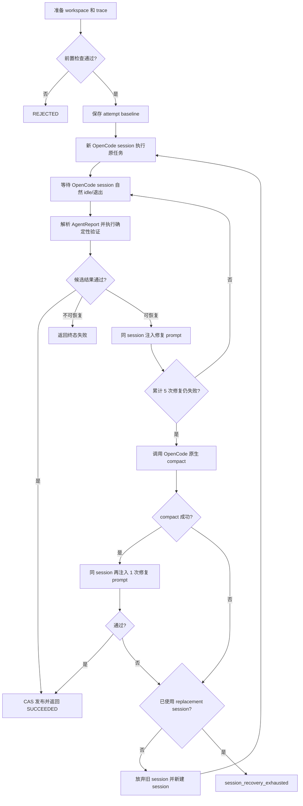

# TaskRun 生命周期

本页解释单个 scheduler attempt 的 TaskRun 状态机与恢复边界。精确入口签名和
RecoveryPolicy 字段以 [API 参考](../../reference/clef-api.md) 与
[实体参考](../../reference/clef-entities.md) 为准。

## 1. 定义与入口

TaskRun 是 `DomainRunner.run_attempt()` 执行的最小运行单元，身份为：

```text
run_id + task.id + attempt
```

实现已经独立放在 `clef-sdk/src/clef_sdk/runtime/taskrun/`：

| 文件 | 职责 |
| --- | --- |
| `runner.py` | 主状态机和有界恢复顺序 |
| `common.py` | runner 共享状态、trace 与 prompt helper |
| `session.py` | OpenCode session 调用、连续性和 compact |
| `evaluation.py` | report 解码和候选结果验证 |
| `checks.py` | workspace、Artifact、effect、tool 等确定性检查 |
| `publication.py` | CAS 发布和终态结果 |
| `policy.py` | RecoveryPolicy 和内部候选结果 |

入口：

```python
result = runner.run_attempt(
    task,
    run_id=run_id,
    attempt=attempt,
)
```

`run_attempt()` 只执行一个 scheduler attempt；外层 retry 仍由
`WorkflowExecutor` 负责。

## 2. 总体流程



默认 `RecoveryPolicy` 为：

```python
RecoveryPolicy(
    repairs_before_compact=5,
    repairs_after_compact=1,
    max_sessions=2,
)
```

因此一次 attempt 最多使用两个语义 session：初始 session 和一个 replacement
session。每个 session 都执行相同的有界恢复顺序，不会无限续写或无限新建 session。

## 3. 无框架超时

Clef SDK 不设置 TaskRun wall-clock timeout，也不会向
`subprocess.run()` 传入 `timeout`。

`OpenCodeAdapter.run()` 调用 `opencode run --format json`。OpenCode 自己消费
session 事件，并在 session 回到 `idle` 或报告错误后退出；Clef SDK
同步等待这个自然退出。

如果应用需要最长等待时间，应当在调用边界实现取消，而不是改变 TaskRun
语义。例如：

```python
from concurrent.futures import ThreadPoolExecutor, TimeoutError

pool = ThreadPoolExecutor(max_workers=1)
future = pool.submit(
    runner.run_attempt,
    task,
    run_id=run_id,
    attempt=1,
)
try:
    result = future.result(timeout=600)
except TimeoutError:
    # 这里只停止调用方等待；由应用决定记录和进程清理策略。
    ...
finally:
    pool.shutdown(wait=False, cancel_futures=True)
```

也可以使用 `asyncio.to_thread()` 配合 `asyncio.wait_for()`。需要注意：
Python 的线程等待超时不会自动终止已经运行的 OpenCode 子进程；需要强制取消时，
应由宿主应用使用独立进程并实现明确的终止策略。

任务内部脚本同样应自行实现超时，例如用 `asyncio.wait_for()`、线程/进程隔离，
并以非零退出码和 stderr 报告超时。`command_exit` verifier 只等待脚本自然退出并
检查退出码。

```python
import asyncio
import sys


async def run_with_script_deadline() -> int:
    process = await asyncio.create_subprocess_exec(*command)
    try:
        await asyncio.wait_for(process.wait(), timeout=script_deadline)
    except TimeoutError:
        process.kill()
        await process.wait()
        print("script timed out", file=sys.stderr)
        return 124
    return process.returncode or 0
```

## 4. Session 行为

一次 adapter 调用的可观察阶段为：

```text
session_running
  -> zero or more OpenCode tool operations
  -> session_tool_result
  -> session_exited
```

OpenCode 负责工具请求、权限响应和工具实际执行。JSON event stream 中，
Clef SDK 记录已经完成或失败的 `tool_use` 结果。最终退出原因规范化为：

- `completed`：正常回到 idle；
- `backend_timeout`：OpenCode 或模型 provider 自己报告超时；
- `error`：其他 session 或进程错误。

`backend_timeout` 不是 Clef SDK 计时器产生的。

## 5. 可恢复与不可恢复错误

以下错误会优先进入同 session 修复：

- AgentReport JSON/envelope 错误；
- 输出 JSON 或 JSON Schema 验证失败；
- 缺少输出、错误路径、错误 digest；
- Agent 报告 `BLOCKED`；
- OpenCode/backend 正常返回的执行错误或 provider timeout；
- OpenCode 返回的工具调用失败。

修复 prompt 包含结构化 ErrorInfo、失败 checks 和失败工具观测。修复 prompt
允许 Agent 检查并修改原任务输出，也允许改用 OpenCode 允许的其他工具。

以下错误不会继续修复：

- 输入 Artifact 被修改；
- verifier 修改 workspace；
- fresh session identity 重复；
- recovery/compact 返回了其他 session identity；
- compact 修改文件或调用工具；
- `WAITING_INPUT`，因为它需要外部输入而不是自动修复。

## 6. 验证顺序

每一轮正常返回后都会重新执行：

```text
decode and correlate AgentReport
  -> resolve provisional ArtifactRef
  -> Artifact constraints
  -> DomainContract verifiers
  -> verifier purity
  -> rebuild final ArtifactRef from bytes
  -> output freshness
  -> input immutability
  -> postconditions
  -> Agent state
```

Workspace diff 和 OpenCode tool events 仍写入 trace，但不会经过 Clef 的
二次权限判定。shell、network、edit、delete、move、外部目录等授权全部由
OpenCode `permission` 配置决定。

JSON Artifact 使用 JSON Schema Draft 2020-12 验证。资源 usage 仍可以作为
trace/WorkflowResult 观测数据记录，但本版本不根据 token 或费用终止 TaskRun。

## 7. Compact 与 replacement session

第五次同 session 修复仍失败后，runtime 调用 adapter 的 `compact()`。
`OpenCodeAdapter.compact()` 对当前 identity 调用 OpenCode 原生
`POST /session/:id/summarize` API，并等待 session 再次 idle。`--command` 只用于
配置型 prompt commands，因此这里不会执行 `--command compact`。

配置了 `adapter.attach_url` 时，compact 复用该 server；否则 adapter 临时启动
同 workspace 的本地 `opencode serve`，完成原生 API 调用且 session 回到 idle
之后关闭 server。server 启动和 session 等待都没有 Clef SDK deadline。

compact 必须：

- 返回完全相同的 session identity；
- 不修改 workspace；
- 不调用 task 工具；
- 正常退出。

compact 成功后注入一次新的修复 prompt。若候选结果仍失败，runtime 放弃当前
session，以 `session_id=None` 新建 replacement session，并重新发送完整原任务；
prompt 会明确说明 workspace 可能含有无效的部分输出。

## 8. Publication

验证通过后的发布路线：

```text
verified bytes
  -> final digest check
  -> ContentAddressedStore
  -> stable ArtifactRef
  -> SessionResult.SUCCEEDED
```

文件 Artifact 写入 CAS；目录 Artifact 当前跳过 CAS。任何 CAS digest 不一致都
产生不可重试的内部错误。
